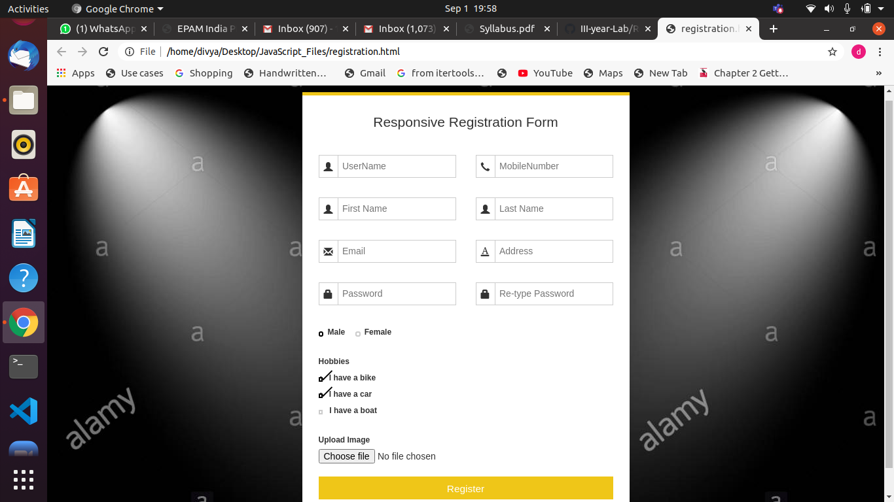

# Registration Page

## Aim of the Experiment
To create the Registration page using html

### Steps or Procedure of experiment

We can prepare the registration page using the html code and some part of css for styles and nice background images.

### Output

